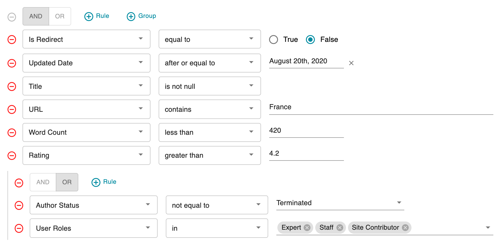

# MUI QueryBuilder

A query builder component for [Material UI](https://mui.com/) and [React](https://react.dev/).

[](https://www.npmjs.com/package/mui-querybuilder)
[](https://opensource.org/licenses/MIT)



## Features

- 🧩 Nested rule groups with configurable depth
- 🔀 Drag & drop rule reordering (powered by [dnd-kit](https://dndkit.com/))
- 📅 Built-in date picker support via [MUI X Date Pickers](https://mui.com/x/react-date-pickers/)
- 🎨 Fully themed via MUI's `ThemeProvider`
- ✅ Query validation API
- 🔧 Custom operators and filter types

## Installation

```bash
npm install mui-querybuilder
```

### Peer Dependencies

This library requires the following peer dependencies:

```bash
npm install react react-dom @mui/material @mui/icons-material @mui/x-date-pickers @emotion/react @emotion/styled date-fns
```

| Package | Version |
|---|---|
| `react` | ≥ 19.0.0 |
| `react-dom` | ≥ 19.0.0 |
| `@mui/material` | ≥ 7.0.0 |
| `@mui/icons-material` | ≥ 7.0.0 |
| `@mui/x-date-pickers` | ≥ 8.0.0 |
| `@emotion/react` | ≥ 11.0.0 |
| `@emotion/styled` | ≥ 11.0.0 |
| `date-fns` | ≥ 3.0.0 |

## Usage

```tsx
import QueryBuilder from "mui-querybuilder";

const filters = [
    {
        label: "Article",
        options: [
            { label: "Title", value: "title", type: "text" },
            { label: "Word Count", value: "word_count", type: "integer" },
            { label: "Published", value: "published", type: "switch" },
            { label: "Updated Date", value: "updated_date", type: "date" },
        ],
    },
];

function App() {
    return (
        <QueryBuilder
            filters={filters}
            query={{
                combinator: "and",
                rules: [
                    { field: "title", operator: "contains", value: "React" },
                ],
            }}
            onChange={(query, valid) => {
                console.log("Query:", query, "Valid:", valid);
            }}
        />
    );
}
```

## API

### Props

| Prop | Type | Default | Description |
|---|---|---|---|
| `filters` | `Filter[]` | `[]` | Filter definitions grouped by category |
| `operators` | `OperatorDef[]` | Built-in operators | Override the default operator set |
| `customOperators` | `Record<string, CustomOperator>` | `{}` | Custom operator types |
| `query` | `Query` | — | Initial query state |
| `maxLevels` | `number` | `1` | Maximum nesting depth for rule groups |
| `sortFilters` | `boolean` | `true` | Alphabetically sort filters within groups |
| `debug` | `boolean` | `false` | Show debug output (formatted JSON + validity) |
| `onChange` | `(query: Query, valid: boolean) => void` | — | Callback fired on query changes |

### Static Methods

```tsx
// Format a query by removing internal IDs
QueryBuilder.formatQuery(query);

// Validate a query (all rules have field, operator, and value)
QueryBuilder.isQueryValid(query);

// Access the default operators
QueryBuilder.operators;
```

### Supported Value Types

| Type | Component | Description |
|---|---|---|
| `text` | `TextField` | Free-text input |
| `integer` | `TextField (number)` | Integer input (no decimals) |
| `number` | `TextField (number)` | Numeric input |
| `date` | `DatePicker` | Date selection via MUI X |
| `select` | `Autocomplete` | Single-value dropdown |
| `multiselect` | `Autocomplete (multiple)` | Multi-value dropdown |
| `radio` | `Radio` | True/False radio buttons |
| `switch` | `Switch` | On/Off toggle |

### Built-in Operators

| Operator | Applicable Types |
|---|---|
| `equal`, `not_equal` | All except multiselect |
| `contains`, `not_contains` | text |
| `less`, `greater`, `less_equal`, `greater_equal` | number, integer |
| `before`, `after`, `before_equal`, `after_equal` | date |
| `in`, `not_in` | multiselect |
| `null`, `not_null` | All types |

## Development

```bash
# Install dependencies
npm install

# Start Storybook (development)
npm run dev

# Run tests
npm test

# Run tests with coverage
npm run test:coverage

# Build the library
npm run build

# Lint & format
npm run check

# Build Storybook
npm run build-storybook
```

## Storybook

Live examples are available on [GitHub Pages](https://tiagofernandez.github.io/mui-querybuilder/).

To run Storybook locally:

```bash
npm run dev
```

## Releasing to npm

To release and publish a new version of the library to npm, follow these steps:

### 1. Bump the Version Locally

Ensure you are on the `main` branch and your working directory is clean, then run `npm version` with `patch`, `minor`, or `major` depending on the scope of the updates. This will bump the version in `package.json` / `package-lock.json` and automatically create a git commit and tag:

```bash
# Verify local state is clean
git status

# Bump the version (e.g. from 2.0.0 to 2.0.1)
npm version patch
```

---

### Option A: Automated via GitHub Actions (Recommended)

This project is configured with a GitHub Actions workflow ([publish.yml](.github/workflows/publish.yml)) to securely publish package updates to npm automatically using **Trusted Publishing (OIDC)**. Since this is already configured on npmjs.com for your repository, **no GitHub secrets or `NPM_TOKEN` are required** to publish from GitHub.

1. **Push the commit and tag to GitHub**:
   Ensure you run `git push --tags` to upload the newly generated version tag:
   ```bash
   git push && git push --tags
   ```

2. **Publish the Release on GitHub**:
   - Go to your GitHub repository page and click on **Releases** (in the right-hand sidebar).
   - Click the **Draft a new release** button.
   - Click the **Choose a tag** dropdown menu.
   - **Select the tag** you just pushed (e.g., `v2.0.1`). *Do not leave this field blank or use a tag that hasn't been pushed.*
   - Fill in the **Release title** (e.g., `v2.0.1`) and write your release notes.
   - Click the **Publish release** button.
   - The workflow will automatically trigger, run tests and formatting checks, build the package, and upload it to the npm registry with provenance.


---

### Option B: Manual/Local Publish

If you prefer to publish manually from your local machine:

1. **Push changes to GitHub**:
   ```bash
   git push && git push --tags
   ```

2. **Authenticate with npm**:
   Log in to your npm account with write permissions for the package:
   ```bash
   npm login
   ```

3. **Publish the package**:
   Publish the package to the registry. The configured `prepublishOnly` lifecycle hook will automatically run the code style checks (`npm run check`), run the test suite (`npm test`), and compile the library files (`npm run build`) before uploading:
   ```bash
   npm publish
   ```

---

### Troubleshooting: Two-Factor Authentication (2FA) 403 Forbidden

If your npm account or the package has Two-Factor Authentication (2FA) enabled, running `npm publish` locally might fail with an `E403 403 Forbidden` error:

```
npm ERR! code E403
npm ERR! 403 403 Forbidden - PUT https://registry.npmjs.com/mui-querybuilder - Two-factor authentication or granular access token with bypass 2fa enabled is required to publish packages.
```

To resolve this:
- **Interactive Publish**: Run `npm publish`. npm will prompt you in the terminal to enter the One-Time Password (OTP) from your authenticator app.
- **Explicit OTP flag**: If the terminal prompt does not appear, pass your authenticator app's OTP directly using the `--otp` flag:
  ```bash
  npm publish --otp=123456
  ```
- **Trusted Publishing (OIDC)**: For automated CI/CD environments (like GitHub Actions), use npm **Trusted Publishing** (OIDC) which requires no static secrets or manual tokens. This is already configured for this repository.
- **Granular Tokens**: If publishing via a custom CI script or CLI without OIDC, generate a **Publish Token** with bypass 2FA enabled from your npm dashboard, set it in your environment (e.g. `NPM_TOKEN`), and configure your `.npmrc` accordingly. Granular tokens are recommended over classic tokens for enhanced security.


## License

[MIT](LICENSE) © Tiago Fernandez
